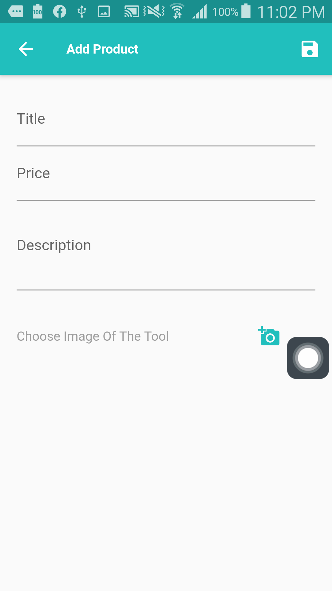

# Dynamic E-Commerce App You Can Sell What You Want (I choose as an example dentist tools)

## Screen Shots

## Home Page

## Add Items To Cart When Press On it

## Determine How Many Of it

## Show The Order

## Order It

## Drawer

## Add Items To Sell Or Edit It

## Delete The Item

## Make Item as Favorite

## Show Favorite Only

## Delete The Order By Swiping left

## Details Page

